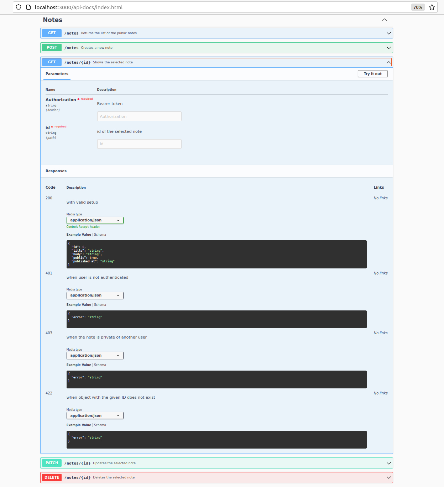

udatapp
======

[](https://github.com/georgiybykov/udatapp/actions)
[](https://github.com/georgiybykov/udatapp/actions)

Ruby on Rails API project to store a data of the users.

---

**The project includes and consists of:**

- Ruby 2.7.5
- Ruby on Rails 6.1.5
- RSpec as framework for tests
- `rswag` for integration specs and generate API documentation by OpenAPI Specification
- Custom authentication with JWT
- API reversional versioning
- `dry-rb` stack

---

#### Fetch and start the project:

```bash
$ git clone git@github.com:georgiybykov/udatapp.git
$ cd qna

# Install dependencies:
$ bundle install

$ cp config/database.yml.sample config/database.yml

$ bundle exec bin/rails db:create
$ bundle exec bin/rails db:migrate
```

#### Run server:
```bash
$ bundle exec bin/rails server
```

Then visit: http://localhost:3000

---

#### Authentication

- To create a new user:

```bash
curl -X POST localhost:3000/api/v2/registration \
     -H 'Content-type: application/json' \
     -d '{ "email": "udatapp@email.com", "password": "123456789" }'
```

- To authenticate the user:

```bash
curl -X POST localhost:3000/api/v2/login \
     -H 'Content-type: application/json' \
     -d '{ "email": "udatapp@email.com", "password": "123456789" }'
```

On successful login will be returned:
```bash
{
  "access_token": <token>,
  "expires_at": <datetime>
}
```
The token will be expired after 24 hours by default.

You should use this token for further requests in `Authorization` header, for example:

```bash
curl -X GET localhost:3000/api/v2/notes \
     -H 'Content-type: application/json' \
     -H 'Authorization: <token>'
```

---

#### Run tests:
```bash
$ bundle exec rspec
```

#### Run linter:
```bash
$ bundle exec rubocop
```

---

#### Generate rswag API documentation:
```bash
$ bundle exec rails rswag:specs:swaggerize
```

#### API documentation will be available at:

http://localhost:3000/api-docs/index.html

#### **Examples:**

- API-docs main page:


- `/note/:id` current v2 endpoint:




- `/note/:id` deprecated v1 endpoint:


___

##### Good luck! May the force be with you!
